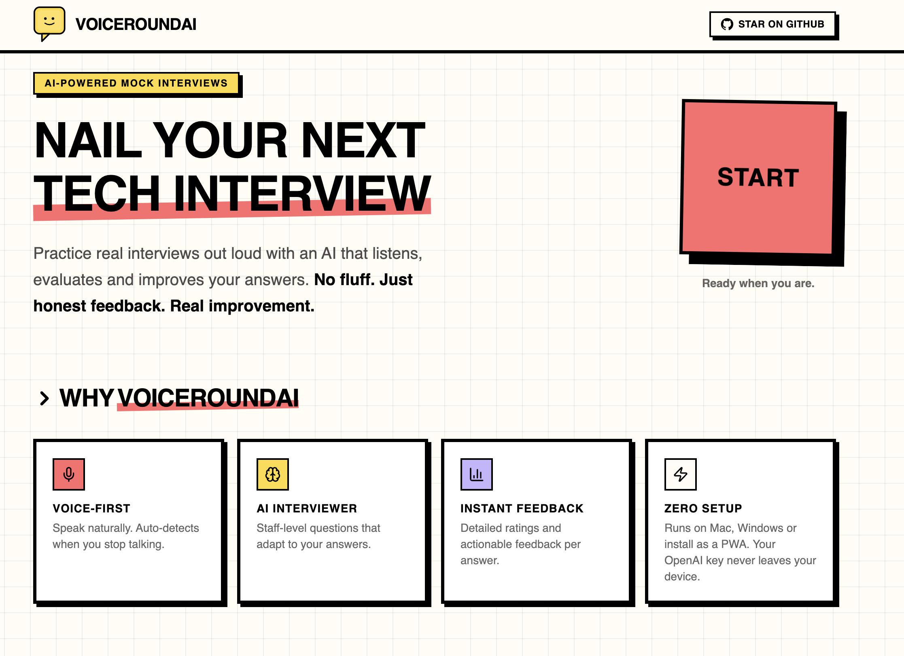
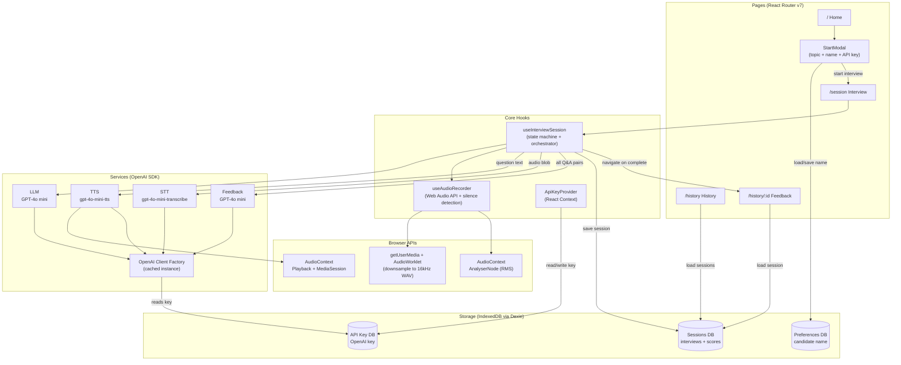
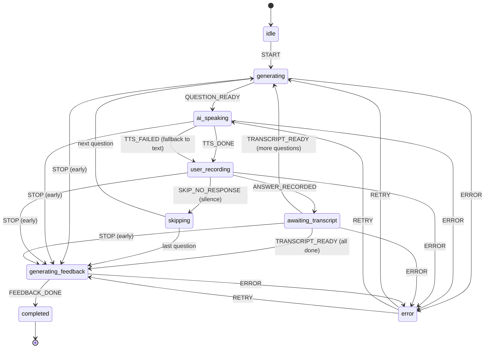

# VoiceRoundAI

AI-powered mock interviewer that helps developers practice technical interviews. The AI asks questions via voice, you answer verbally and you get detailed feedback with ratings.



## Why I Built This

I wanted to get better at explaining technical concepts out loud, the way you have to in real interviews. This app lets me practice that and get honest feedback on both my answers and how I communicate them.

Most mock interview tools I found were paid and I couldn't customize them to focus on what I actually needed to work on. So I made this open source. You can tweak the prompts, add your own topics or change how feedback works. Make it yours.

## Tech Stack

- **Frontend:** Vite 8 + React 19 + TypeScript 5.9
- **Styling:** Tailwind CSS v4 + shadcn/ui
- **AI / Voice:** OpenAI (GPT-4o mini for LLM + STT, gpt-4o-mini-tts for TTS)
- **Storage:** IndexedDB (Dexie.js). Fully local, no backend
- **Desktop (optional):** Tauri v2 shell for macOS and Windows (lightweight native installers, no Electron)
- **PWA (optional):** vite-plugin-pwa generates a Workbox service worker and Web App Manifest. Installable from mobile (Android Chrome, iOS Safari) and desktop browsers (Chrome / Edge / Brave)
- **Testing:** Vitest + React Testing Library + MSW
- **CI:** GitHub Actions (lint + format + unit tests + build + PWA invariants; tag pushes build per-arch macOS `.dmg` files (aarch64 + x64) and a Windows NSIS `.exe` release matrix)
- **Quality:** Lighthouse CI (performance + accessibility)
- **Pre-commit:** Husky + lint-staged
- **Analytics:** Vercel Analytics (web only)

## BYOK (Bring Your Own Key)

This app requires your own OpenAI API key. No keys are shipped or hardcoded. Where the key lives and how it travels depends on the build:

- **Web (browser tab):** the key is stored in IndexedDB on your device and is sent directly from the browser to OpenAI. After you save a key, the app calls `navigator.storage.persist()` to ask the browser not to evict the database under storage pressure (Chromium grants this for engaged sites; Safari almost always declines silently).
- **PWA (installed web app on mobile or desktop):** same as web. The PWA shares the browser's IndexedDB. The install CTA on desktop surfaces this tradeoff inline. Two implications worth knowing:
  - A successful XSS on the page can read the key and bill your OpenAI account.
  - Browser extensions with the right permissions can read IndexedDB on this origin.
- **Desktop (Tauri):** the key is stored in the system keychain (Keychain on macOS, Credential Manager on Windows). All OpenAI traffic is routed through the bundled Rust proxy so the key never reaches the renderer. Browser extensions can't reach it.

The Settings dialog has a **Forget my key** button (web/PWA/Tauri all). Use it on shared devices. The dialog also has a "How is my key stored?" link that opens the same explainer the install CTA uses.

## How It Works

1. Click **Start** → enter your OpenAI API key (first time only), select a topic and question count (5, 7, or 10)
2. Grant microphone access when prompted
3. AI asks questions via text-to-speech
4. You answer verbally — mic records and auto-detects when you stop speaking
5. After all questions, AI generates structured feedback (rating + confidence level + commentary per question + overall summary)
6. Feedback saved to IndexedDB, viewable anytime from History

## Architecture



### Interview Flow (State Machine)



### Data Flow

```text
User clicks Start
    │
    ▼
┌─────────────────────────────────────────────────────────────────┐
│  INTERVIEW LOOP (repeats per question)                          │
│                                                                 │
│  1. LLM generates question (GPT-4o mini + conversation history) │
│  2. TTS speaks question aloud (gpt-4o-mini-tts → AudioContext)  │
│  3. User answers verbally (AudioWorklet → 16kHz WAV + silence)  │
│  4. STT transcribes answer (gpt-4o-mini-transcribe)             │
│     └─ waits for transcript before generating next question     │
└─────────────────────────────────────────────────────────────────┘
    │
    ▼
Feedback generation (GPT-4o mini)
    → per-question: rating, confidence, commentary, model answer
    → overall summary
    │
    ▼
Session saved to IndexedDB → navigate to Feedback page
```

## Interview Topics

15 topics across 4 groups:

- **Languages & Runtimes (5):** JavaScript & TypeScript, Python, Go, Java, Rust
- **Frameworks (3):** React & Next.js, Node.js, FastAPI & Django
- **Concepts (6):** System Design (Frontend), System Design (Backend), System Design (Full-Stack), Docker & Kubernetes, AWS & Cloud, GraphQL
- **Behavioral (1):** Behavioral & STAR

## Download

Prebuilt desktop installers for macOS (Apple Silicon and Intel, separate builds) and Windows (x64) are attached to every tagged release on the [Releases page](https://github.com/rajat-mehra05/voice-round/releases/latest).

Builds are **unsigned**, so the OS shows a one-time warning the first time you launch. This is expected. The bypass below is needed only once per install.

### Installing on macOS

1. Pick the right `.dmg` for your Mac:
   - **Apple Silicon (M1, M2, M3, M4):** `VoiceRoundAI_x.y.z_aarch64.dmg`
   - **Intel:** `VoiceRoundAI_x.y.z_x64.dmg`

   Not sure which you have? Click the Apple menu in the top-left, then **About This Mac**. If the chip line says "Apple", you want the aarch64 build. If it says "Intel", you want the x64 build.

2. Open the DMG and drag VoiceRoundAI into Applications.
3. First launch will say **"VoiceRoundAI cannot be opened because the developer cannot be verified."** Click Cancel.
4. In Finder, **right-click** (or Ctrl-click) the VoiceRoundAI app in Applications and choose **Open**. Click **Open** again in the confirmation dialog. macOS trusts the app from then on.

If right-click → Open doesn't offer the trust option (happens on some newer macOS builds), run this once in Terminal:

```bash
xattr -dr com.apple.quarantine /Applications/VoiceRoundAI.app
```

### Installing on Windows

1. Download the `.exe` from the latest release and run it.
2. Windows SmartScreen shows **"Windows protected your PC."** Click **More info**, then **Run anyway**.
3. The installer downloads the Microsoft WebView2 runtime if it isn't already installed (small, one-time). Follow the prompts.

### Installing as a PWA (mobile or desktop browser)

The web build is also installable as a Progressive Web App. No download, no OS warning. Tradeoff: the API key lives in the browser's IndexedDB instead of the OS keychain (see [BYOK](#byok-bring-your-own-key)). The desktop install page surfaces this tradeoff inline.

- **Android Chrome / Edge / Brave:** open the site, tap the **Install** CTA. Chromium handles the rest.
- **Android Firefox:** open the site, tap the menu (⋮), choose **Install**.
- **iOS Safari:** open the site, tap **Share** → **Add to Home Screen**. iOS doesn't have a one-tap install API; the app shows the same instructions inline.
- **Desktop Chrome / Edge / Brave:** open the site, click **Install in browser** in the install card (under the desktop download buttons). Chromium opens its install dialog.
- **Desktop Safari (macOS Sonoma+):** open the site, then **File → Add to Dock**. Safari has no JavaScript install API.
- **Desktop Firefox:** PWA install isn't supported in Firefox desktop. Use the Tauri download instead.

The PWA loads the home page offline (the app shell is precached). Interview flows still need network because OpenAI calls are required.

### Updates and diagnostics

The app checks GitHub Releases on launch and shows a non-blocking toast when a newer version is available. **Settings → Check for updates** runs the same check on demand and surfaces errors (unlike the silent launch check).

Crash traces and stage-duration logs are written via `tauri-plugin-log` to:

- macOS: `~/Library/Logs/com.voiceround.app/voiceround.log`
- Windows: `%LOCALAPPDATA%\com.voiceround.app\logs\voiceround.log`

The file is capped at 1 MB with one-file rotation so the on-disk footprint stays bounded.

Quitting (Cmd+Q, menu quit, or closing the window) during an active recording shows a confirmation dialog so an in-flight answer isn't lost silently.

## Getting Started

```bash
npm install
npm run dev
```

### Desktop (optional)

Running the native desktop shell requires a [Rust toolchain](https://www.rust-lang.org/tools/install) (stable, 1.77+). Once installed:

```bash
npm run tauri:dev     # dev loop, hot reloads the frontend, rebuilds Rust on change
npm run tauri:build   # produces a .dmg (macOS) or NSIS .exe (Windows) in src-tauri/target/release/bundle/
```

First `tauri:build` takes a few minutes while Cargo fetches and builds Tauri's crate graph. Subsequent builds are much faster.

## Build Targets

The project supports two build targets. The active target is selected via `VITE_TARGET`, loaded from `.env` (web, default) and `.env.tauri` (desktop). The web build doubles as the PWA — vite-plugin-pwa is wired in `vite.config.ts` and only runs when `mode !== 'tauri'`.

| Script                                 | Command                                         | Output                                                                                                  |
| -------------------------------------- | ----------------------------------------------- | ------------------------------------------------------------------------------------------------------- |
| `npm run build`                        | alias for `build:web`                           | web build (also serves as the PWA bundle)                                                               |
| `npm run build:web`                    | `tsc -b && vite build`                          | web build with `dist/sw.js` + `dist/manifest.webmanifest` injected                                      |
| `npm run build:tauri`                  | `tsc -b && vite build --mode tauri`             | frontend bundle only, consumed by `tauri:build`. No SW, no manifest                                     |
| `npm run tauri:dev`                    | `tauri dev`                                     | launches the native desktop app with the dev server                                                     |
| `npm run tauri:build`                  | `tauri build`                                   | produces a packaged `.dmg` (macOS) or NSIS `.exe` (Windows) desktop installer                           |
| `npm run sync-version`                 | `node scripts/sync-version.mjs`                 | syncs version across `package.json`, `src-tauri/Cargo.toml`, `src-tauri/tauri.conf.json`                |
| `npm run check:apple-touch-icon`       | `node scripts/check-apple-touch-icon.mjs`       | asserts `public/apple-touch-icon.png` is exactly 180x180 with no alpha channel (iOS PWA invariant)      |
| `npm run check:no-tauri-in-web-bundle` | `node scripts/check-no-tauri-in-web-bundle.mjs` | greps `dist/assets/*.js` to assert no `@tauri-apps/*` imports leaked into the web build (PWA invariant) |

Tauri configuration is gated behind `mode === 'tauri'` in `vite.config.ts`: relative `base`, modern webview target, and the `TAURI_*` env prefix.

In application code, read the current target via `import.meta.env.VITE_TARGET` or import the selected adapter via `@/platform`. The Rust shell lives in `src-tauri/` and owns OpenAI traffic on desktop: the renderer invokes Tauri commands, Rust pulls the key from the system keychain and runs the HTTP request (including streaming chat + TTS responses) outside the webview. The web build keeps the direct-from-browser path unchanged.

## Error Handling

- **Invalid API key (401):** prompts user to update key in Settings
- **Quota exhausted (429 — billing):** links to OpenAI billing page
- **Rate limited (429 — rate):** automatic retry with exponential backoff (max 3 attempts)
- **Network failure:** inline error with retry button
- **Request timeout:** per-call timeouts (STT: 60s, LLM: 20s, TTS: 30s, Feedback: 45s)
- **TTS failure:** falls back to displaying question as text

## Audio & Microphone

- Browser compatibility check (MediaRecorder API) before session start
- Mic device detection and permission gating
- Native silence detection via Web Audio API `AnalyserNode` (RMS amplitude). Auto-stops recording after 6 seconds of silence
- Max recording duration: 4 minutes per answer (with 30s warning)
- Transcription runs in the background. The next question generates as soon as the transcript is ready
- All recordings are produced as 16kHz mono WAV by an `AudioWorklet` downsampler that runs on the audio thread. Output container is uniform across browsers and OSes. The worklet is preloaded at app boot so first-record latency matches subsequent recordings
- On desktop (Tauri): the worklet streams chunks to the Rust proxy during recording so the upload isn't waiting for mic-stop
- All in-flight API calls cancelled via `AbortController` on navigation/stop

### Mobile (iOS Safari, Android Chrome)

The web build runs as a PWA on mobile. The same audio pipeline is used, with a few iOS-specific workarounds:

- **AudioContext starts suspended on iOS** even when triggered from a user gesture if any prior `await` consumed the activation. The TTS playback path (`src/services/tts/playback.ts`) and the recorder (`src/hooks/useAudioRecorder/useAudioRecorder.ts`) both call `audioContext.resume()` explicitly to handle this
- **Sample rate is fixed to hardware on iOS** (typically 48k or 44.1k) regardless of what's passed to `new AudioContext({ sampleRate })`. The downsample worklet at `public/audio/downsample-worklet.js` derives its resample ratio from the runtime `sampleRate` global rather than assuming 48k
- **Tab backgrounding** suspends the AudioContext mid-TTS. The playback path listens for `visibilitychange` and explicitly suspends and resumes the context on hide and show so the transition is deterministic across iOS versions
- **Lock-screen / Control Center** shows a tile titled `VoiceRoundAI` with subtitle `Mock interview` during TTS via the MediaSession API. Lock-screen pause and play map to AudioContext suspend and resume
- **Currently deferred:** full mid-recording pause-and-resume on `visibilitychange`. The desktop `blur` handler still finishes the recording and submits a partial answer if the user backgrounds the tab during their answer. Tracked as a follow-up because the resume UI needs to integrate with the interview state machine
- **Currently deferred:** streaming TTS playback on iOS via `ManagedMediaSource`. The web path uses `AudioContext.decodeAudioData` which waits for the full TTS response before playing. Streaming would shave ~300-1000ms off first-audio latency. Plan section PWA.5 has the implementation outline

## Contributing

Contributions are welcome! Feel free to open an issue or submit a pull request — whether it's a bug fix, a new feature idea, or just a suggestion to improve the experience. All input is appreciated.

### Resetting the PWA service worker locally

The web build registers a service worker (vite-plugin-pwa) that precaches the app shell. The dev server intentionally does NOT register the SW, but if you previously ran the production build via `npm run preview` or hit a deployed environment from your dev browser, an old SW can stick around and serve cached chunks across reloads.

To reset SW state for the origin you're testing, paste this into the browser DevTools console:

```js
// Unregister all SWs for this origin and clear their caches.
(async () => {
  const regs = await navigator.serviceWorker.getRegistrations();
  await Promise.all(regs.map((r) => r.unregister()));
  const keys = await caches.keys();
  await Promise.all(keys.map((k) => caches.delete(k)));
  console.log(`Unregistered ${regs.length} SW(s) and cleared ${keys.length} cache(s). Reload.`);
})();
```

Then hard-reload (Cmd+Shift+R / Ctrl+Shift+R). DevTools → **Application** → **Service Workers** also has a per-origin "Unregister" button if you prefer the UI.

### Service Worker rollback runbook (production)

If a bad SW deploy ships and users are stuck loading broken cached chunks, deploy [public/sw-killswitch.js](public/sw-killswitch.js) at `/sw.js` to clear every controlled client. The kill-switch unregisters itself on activation, drops all caches, and force-reloads every controlled tab.

Steps in order:

1. **Copy the kill-switch over the live SW path.** Rename `public/sw-killswitch.js` to `public/sw.js` (or otherwise arrange for `dist/sw.js` to contain the kill-switch contents on the next build). The path must match `/sw.js` exactly — different paths leave the live SW in place because clients only re-fetch what they registered against.
2. **Verify Cache-Control on `/sw.js` is `no-cache`.** Browsers honour up to 24h cache on SW responses by default. The vercel.json in this repo already sets `Cache-Control: no-cache, no-store, must-revalidate` for `/sw.js` — confirm the deployed response has that header (`curl -I https://your-domain/sw.js | grep -i cache-control`). Without it, the kill-switch can sit unfetched on user devices for hours.
3. **Deploy.** Within minutes (or the next visit, whichever comes first) every controlled client picks up the new SW, runs the activation handler, and reloads.
4. **Confirm rollback landed.** Open the deployed origin in a tab that previously had the bad SW. DevTools → **Application** → **Service Workers** should show the kill-switch in `activated` state briefly, then no SW at all. The page should load fresh from the network with no cached resources.
5. **Clean up.** After all users have rotated through (~24h is a safe estimate), restore the build to its normal state. The next normal deploy installs a fresh SW with no cache or controller leftovers.

The kill-switch handler intentionally never serves any cached response. Even if a client hits it before activation finishes, requests fall straight through to the network.

### Verifying production security headers

The deployed web build serves a strict CSP and Permissions-Policy via [vercel.json](vercel.json). To confirm a deploy's actual response headers:

```bash
curl -sI https://your-domain | grep -iE 'content-security-policy|permissions-policy|referrer-policy|cross-origin-opener-policy|strict-transport-security'
```

Expect six headers. The most important is `content-security-policy`: its `connect-src` must include `https://api.openai.com` (or the OpenAI SDK calls fail) and `https://api.github.com` (or the desktop-download CTA fails to fetch the latest release manifest). After making changes to the CSP, walk through the home page, the start modal, and one full interview turn with the DevTools console open. Zero CSP violations is the standard.

## License

[MIT](LICENSE)
